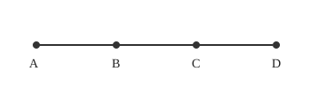
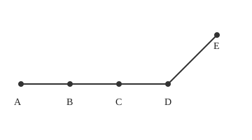
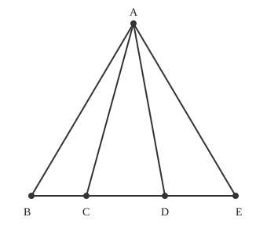
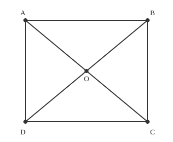
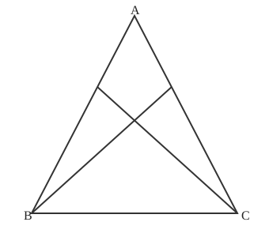

# 课时34. 图形计数初步

## 🎯 全局内容要点

一句话概括本节课全部核心知识点：图形计数使用分类枚举、有序计数，利用对应思想，把三角形计数转化成线段计数。
核心符号/基础公式：$\boldsymbol{线段总数= (端点数-1)+ (端点数-2)+\dots+1}$

---

## 知识模块1｜线段计数（有序枚举）

### 配套例题

例1 下图中有多少条线段？（4个端点） 列式/推导：

$$
\begin{align*} &3+2+1 \\ =&6 \end{align*}
$$

例2 下图中有多少条线段？（5个端点） 列式/推导：

$$
\begin{align*} &4+3+2+1 \\ =&10 \end{align*}
$$

例3 下图中有多少条线段？（折线段，两段分开计数） 列式/推导：

$$
\begin{align*} & (3+2+1)+ (1) \\ =&6+1 \\ =&7 \end{align*}
$$

### 📌 对应小节总结

例1的两种解法，本质上并没有优劣之分，但都需要分类后把每一类的结果相加，都需要做到有序的枚举。

---

## 知识模块2｜三角形计数（对应思想，转化线段）

### 配套例题

例4 下图中有几个三角形？（顶点相同，底边一条线段，4个底端点） 列式/推导：

$$
\begin{align*} &3+2+1 \\ =&6 \end{align*}
$$

### 📌 对应小节总结

例4既可以看成是例1的推广，也可以用对应思想直接利用例1的结果求解。

---

## 知识模块3｜复杂图形三角形计数（多层分类）

### 配套例题

例5 下图中有几个三角形？（长方形对角线相交图形） 列式/推导：

> 分类：小三角形4个，两个小三角形拼成的大三角形4个
> $$
\begin{align*} &4+4 \\ =&8 \end{align*}
$$

例6:下图中有几个三角形？（内部交叉线段复杂三角图） 列式/推导：

> 分类：小三角形6个，两个小三角形拼成的三角形2个
> $$
\begin{align*} &6+2 \\ =&8 \end{align*}
$$
### 📌 对应小节总结

复杂图形不能直接套线段公式，需要分类枚举：先数最小单元图形，再数由2个、3个单元拼成的图形，全部相加。

---

## ⚠️ 本课时易错提醒

1. 计数时跳着数，发生重复数或者漏数，一定要 **有序、按类别数**
2. 折线图形，直接把全部端点代入公式，忽略图形断开，错误计算
3. 复杂三角形，直接硬套线段公式，没有区分图形结构，公式只适用于共顶点的三角形
4. 只数小图形，漏掉多个小图形拼出来的大图形

---

## ✨ 全课时综合汇总

1. 数线段：直线上n个端点，线段总和：$(n-1)+ (n-2)+\dots+1$；折线图形分段分别计算再相加。
2. 共顶点三角形：底边有多少线段，就对应多少个三角形，可以直接复用线段计数结果。
3. 陌生复杂图形，不要死套公式，优先分类枚举：从小到大，一类一类数，做到不重复、不遗漏。
4. 核心思想：分类枚举 + 对应转化，把新问题转化成已经会做的旧题目。
