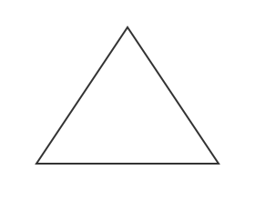
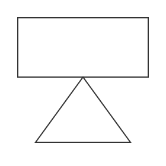
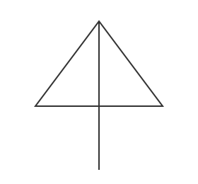
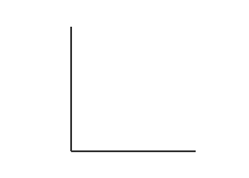
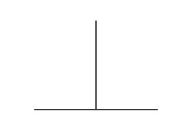

# 课时33. 奇偶分析

## 🎯 全局内容要点

1. 奇偶分析初步
2. 一笔画问题初步

---

## 知识模块1｜加减算式奇偶判定（填加号、减号）

### 配套例题

例1：能否在下面的方框中填入加号或减号，使等式成立？

$9\square8\square7\square6\square5\square4\square3\square2\square1=4$

列式/推导：
1. 偶数：2，4，6，8
2. 奇数：1，3，5，7，9
3. 偶数无论加减，结果都是偶数
4. 奇数个奇数加减，结果是奇数
5. 最后偶数加减奇数，结果是奇数

### 📌 对应小节总结

1. 任意个偶数加减，结果还是偶数；
2. 任意个偶数个奇数加减，结果是偶数；
3. 任意个奇数个奇数加减，结果是奇数；

---

## 知识模块2｜开关场景奇偶逻辑推理

### 配套例题

例2：小明有3个台灯，每个台灯都有一个开关，按一下台灯会亮，再按一下台灯会暗。一开始3个台灯都暗着，如果小明每次按两个开关，若干次以后，能让3个台灯都变亮？

列式/推导：

$$
\text{单盏灯由暗转亮按压次数：奇数}\\
\text{3盏灯全部点亮总按压次数：奇数+奇数+奇数}=奇数\\
\text{每次按2个开关，累计总按压次数：}2\times\text{操作次数}=偶数
$$

奇数、偶数无法相等，做不到让3盏台灯全部亮起。

### 📌 对应小节总结

单盏台灯从熄灭到点亮需要按压奇数次；每次固定按压2个开关，整体总按压次数必然是偶数，奇偶属性冲突，目标无法达成。

---

## 知识模块3｜一笔画图形奇偶判定

### 配套例题

例3：下列图形，能不能用一笔画成（每条线不能重复）？
列式/推导：

1. 基础定义：从一个点延伸出奇数条线段，该点为奇点；延伸偶数条线段，该点为偶点，奇点总数必定是偶数。
2. 分图形核验：

<table>
<tr>
<td></td>
<td></td>
<td></td>
</tr>
<tr>
<td>长方形 奇点数：0 ✓ 可一笔画</td>
<td>独立三角形 奇点数：0 ✓ 可一笔画</td>
<td>矩形+三角形 奇点数：0 ✓ 可一笔画</td>
</tr>
</table>

<table>
<tr>
<td></td>
<td></td>
<td></td>
<td></td>
</tr>
<tr>
<td>三角形短线 奇点数：2 ✓ 可一笔画</td>
<td>直角折线 奇点数：2 ✓ 可一笔画</td>
<td>T字形 奇点数：4 ✗ 不可一笔画</td>
<td>竖线连接四条横线 奇点数：6 ✗ 不可一笔画</td>
</tr>
</table>

### 📌 对应小节总结

1. 偶点：从一点出发的线段有偶数条
2. 奇点：从一点出发的线段有奇数条
3. 连通图都是偶点：可以一笔画
4. 有2个奇点的连通图：可以一笔画。从一个奇点出发，最终到达另一个奇点
5. 超过2个奇点的连通图：不可以一笔画

---

## ⚠️ 本课时易错提醒

1. 加减填符号题型：盲目枚举符号组合，不会用奇偶性快速排除无解情况
2. 开关推理题型：搞错单盏灯点亮需要的按压次数奇偶属性，算错全局总按压次数的奇偶性
3. 一笔画题型：漏做连通性检查、数错奇点个数，忽略奇点总数只能是偶数这个硬性规律

---

## ✨ 全课时综合汇总

三类题目解题底层逻辑统一为奇偶校验：先算出目标结果需要的奇偶属性，再分析操作本身能产出的奇偶属性，属性矛盾即可直接判定无解；一笔画依托奇点（奇偶属性）完成可行性判定，连通且奇点为0/2才能完成一笔画。